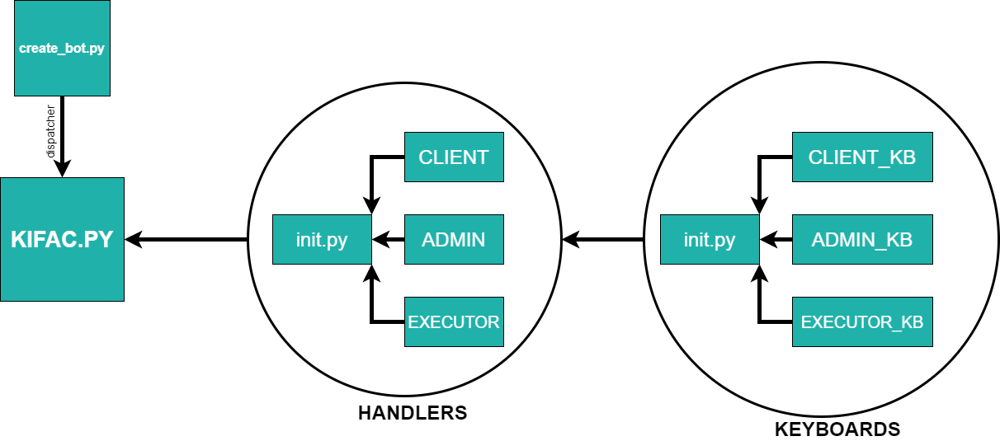

#  KFC_TG_BOT(KTB)

## Первый запуск
Если репозиторий с ботом был впервые загружен на ваш ПК, то перед началом разработки запустите файл <code>update.bat</code>, он сам установит виртуальное окружение и загрузит все необходимые библиотеки, после чего можете приступать к разработке.
___
Для запуска бота необходимо запустить файл <code>bot_run.bat</code>

## Структура проекта

### Ссылка на бота в телеграмме 
<a href="http://t.me/Kifas_bot">➡️<b>ТЫК!!!</b>⬅️<a>